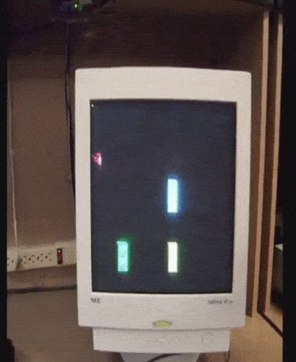
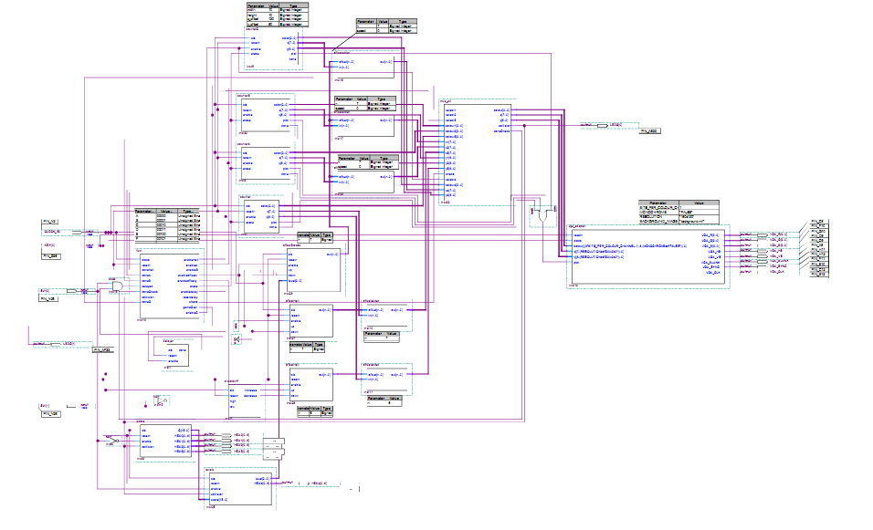
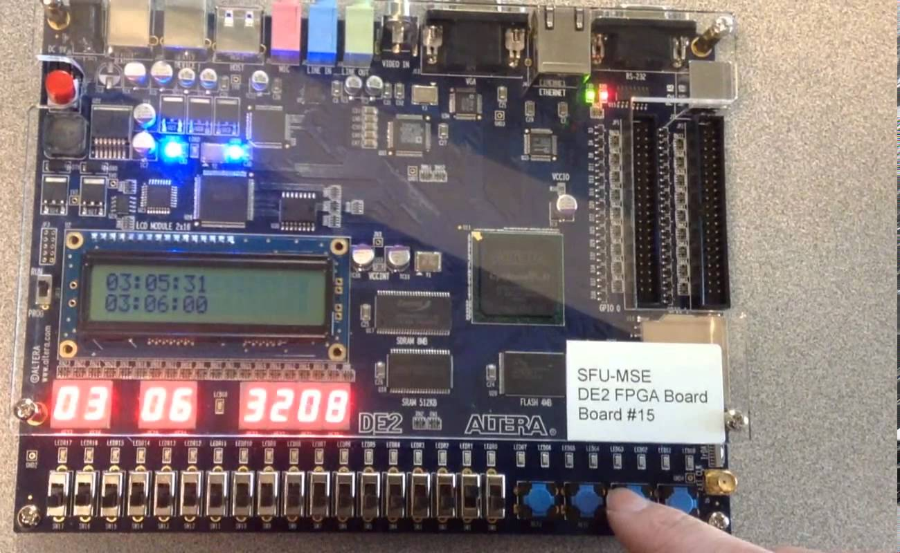

## Helicopter Game

* Classic [helicopter game](http://www.helicoptergame.net/) re-created at the hardware level 
* Written entirely in Verilog (hardware description language) 
* Runs on Altera DE2 FPGA circuit board
* [Technical Report](https://github.com/ajitpawar/helicopter-game/Technical-Report.pdf)

#### Demo

 
#### Circuit Design

#### Altera DE2 board

